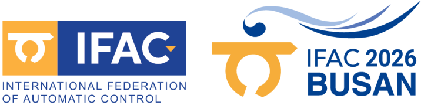
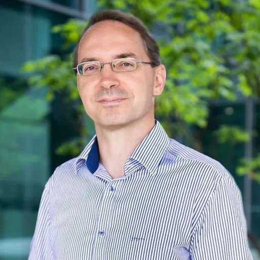
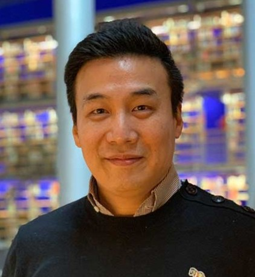
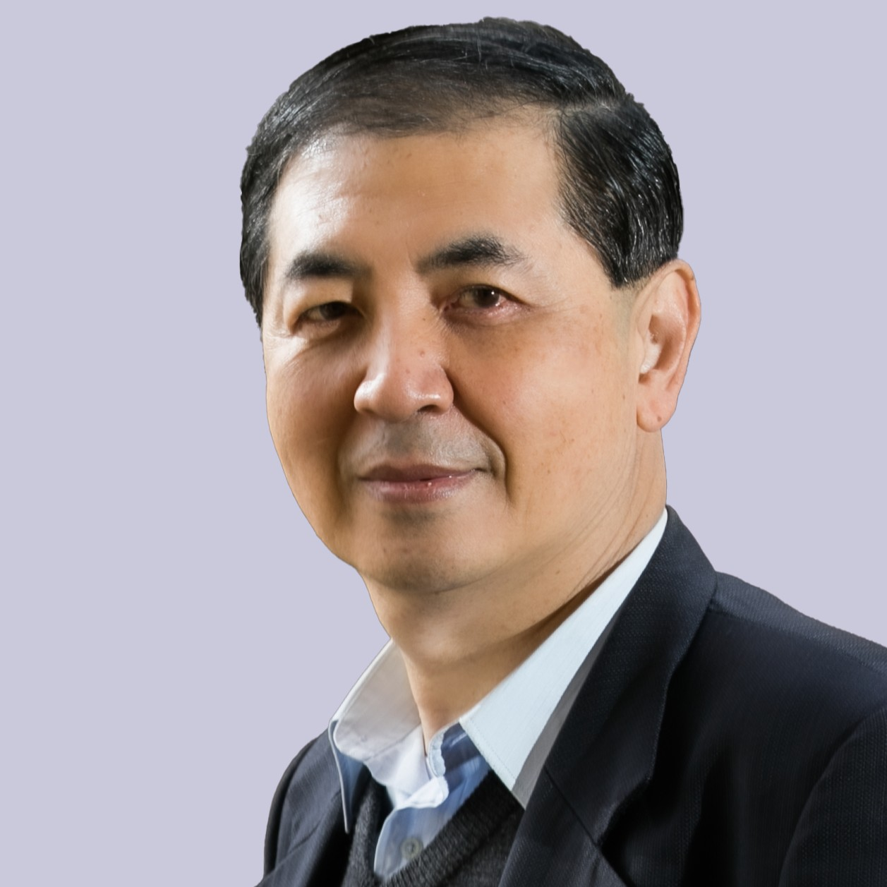
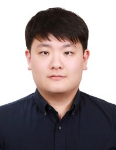
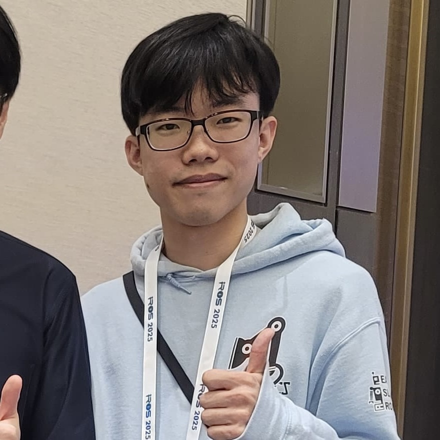

  
  

## Workshop Overview
Robotics poses an increasingly demanding set of challenges to control theory, driven by the emergence of new robotic concepts (such as soft and biohybrid systems) and by the growing need for physical interaction, autonomy, and operation in unstructured environments. At the same time, new opportunities are opening up, including the wider availability of advanced robotic platforms and the successful integration of learning-based components. In this evolving landscape, the theory and practice of robot control play a central role.

Despite this growing relevance, control-theoretic contributions addressing these challenges are often fragmented across paradigms, communities, and venues. This workshop provides a dedicated forum to reconnect these efforts and to collectively reflect on which challenges remain open, how their formulation is evolving, and how they relate to both classical control theory and emerging technologies.

The workshop will combine short perspective talks with extended, structured discussion sessions. Each invited speaker will be asked to articulate one to three open challenges in robot control and to reflect on how these challenges connect to existing theory and current practice. Discussion sessions will focus on contrasting perspectives, clarifying assumptions, and highlighting common structural themes and limitations across different approaches.

This workshop represents a second, complementary step in a broader community effort to strengthen the intellectual foundations of robot control across societies. While Part I (to be held at ECC 2026) focuses on surfacing open challenges and perspectives from invited experts, this workshop provides a forum within the IFAC community to further examine and contextualize these challenges through the lens of automatic control, without presupposing convergence toward a single agenda or set of prescriptions.

<!-- ## Objectives -->

## Target Audience
The workshop targets researchers in control and robotics whose work engages with the modeling, analysis, and control of complex robotic systems, particularly in settings involving physical interaction, uncertainty, hybrid behavior, and learning-enabled components. It is especially relevant for those interested in the foundations of robotics control, the limits of existing frameworks, and the formulation of new problems arising from emerging robotic platforms and technologies.

Relevant research areas include, but are not limited to, on **the control theory and engineering** side:
* nonlinear, geometric, and energy-based control
* hybrid, discrete-event, and supervisory systems
* optimization-based control and model predictive control
* learning-based, data-driven, and adaptive control
* robustness, uncertainty, and safety-critical control
* integration of control with perception, planning, and autonomy

And, from the **robotics** perspective:
* aerial robotics and other floating base systems
* modeling and control of compliant, soft, and underactuated robots
* physical interaction, impedance control, and human–robot interaction
* whole-body, humanoid, and multi-contact control

The intended audience includes faculty members, postdoctoral researchers, and PhD students, as well as advanced practitioners from research-oriented industry who are concerned with principled system design rather than application-specific tuning. The workshop aims to attract participants from both the control and robotics communities and to foster dialogue across methodological and disciplinary boundaries.

## Invited Speakers

<!-- ### Early to Mid Career -->

  

    
    

      <h3>Christian Ott</h3>
      <h4>TU Wien, Austria</h4>
    

  

  

    
    

      <h3>Jinoh Lee</h3>
      <h4>German Aerospace Center (DLR), Germany</h4>
    

  

  

    
    

      <h3>Sehoon Oh</h3>
      <h4>DGIST, Korea</h4>
    

  

  

    
    

      <h3>Cosimo Della Santina</h3>
      <h4>TU Delft, The Netherlands</h4>
    

  

  

    
    

      <h3>Woolim Hong</h3>
      <h4>North Carolina State University, USA</h4>
    

  

  

    
    

      <h3>Li-Chen Fu</h3>
      <h4>National Taiwan University, Taiwan</h4>
    

  

  

    
    

      <h3>Inkyu Jang</h3>
      <h4>Seoul National University, Korea</h4>
    

  

## Program Schedule

| Time | Session |
|------|---------|
|09:00-09:05| Opening |
|09:05-09:40| **Session I — Model-based interaction control: rigid, compliant, and soft** Christian Ott (TU Wien) |
|09:40-10:15| Jinoh Lee (DLR) |
|10:15-10:45| *Coffee break* |
|10:45-11:20| Sehoon Oh (DGIST) |
|11:20-11:55| Cosimo Della Santina (TU Delft) |
|11:55-13:20| *Lunch break* |
|13:20-13:55| **Session II — Humans in the loop: interaction, autonomy, and learning** Woolim Hong (NC State University) |
|13:55-14:30| Li-Chen Fu (National Taiwan University) |
|14:30-15:05| Inkyu Jang (Seoul National University) |
|15:05-15:15| Q&A buffer |
|15:15-15:45| *Coffee break* |
|15:45-16:20| **TBD** |
|16:20-17:30| Moderated discussion with all speakers |
|17:30-17:45| Closing remarks |

## Organizers

  

    
    

      <h3>Cosimo Della Santina</h3>
      <h4>TU Delft, The Netherlands</h4>
    

  

  

    
    

      <h3>Kyoungchul Kong</h3>
      <h4>Korea Advanced Institute of Science and Technology (KAIST), Korea</h4>
    

  

  

    
    

      <h3>Kaoru Yamamoto</h3>
      <h4>Kyushu University, Japan</h4>
    

  

  

    
    

      <h3>Manuel Keppler</h3>
      <h4>German Aerospace Center (DLR), Germany</h4>
    

  

  

    
    

      <h3>Sylvia Herbert</h3>
      <h4>University of California San Diego, USA</h4>
    

  

  

    
    

      <h3>Fumiya Matsuzaki</h3>
      <h4>Kyushu University, Japan</h4>
    

  

  

    
    

      <h3>Yuhe Gong</h3>
      <h4>University of Nottingham, UK</h4>
    

  

  

    
    

      <h3>Daniele Caradonna</h3>
      <h4>Scuola Superiore Sant'Anna, Italy</h4>
    

  

## Expected Outcomes
With this workshop, we aim to strengthen the Robot Control community within IFAC and connect it to researchers active in robotics and related areas. Expected outcomes include:
* a clearer articulation of open challenges in robot control and of how they are perceived across different communities,
* improved mutual understanding of underlying assumptions, limitations, and points of tension between control-theoretic and robotics-oriented approaches,
* material that may inform future discussions, collaborations, or community efforts, without presupposing convergence toward specific solutions or agendas.